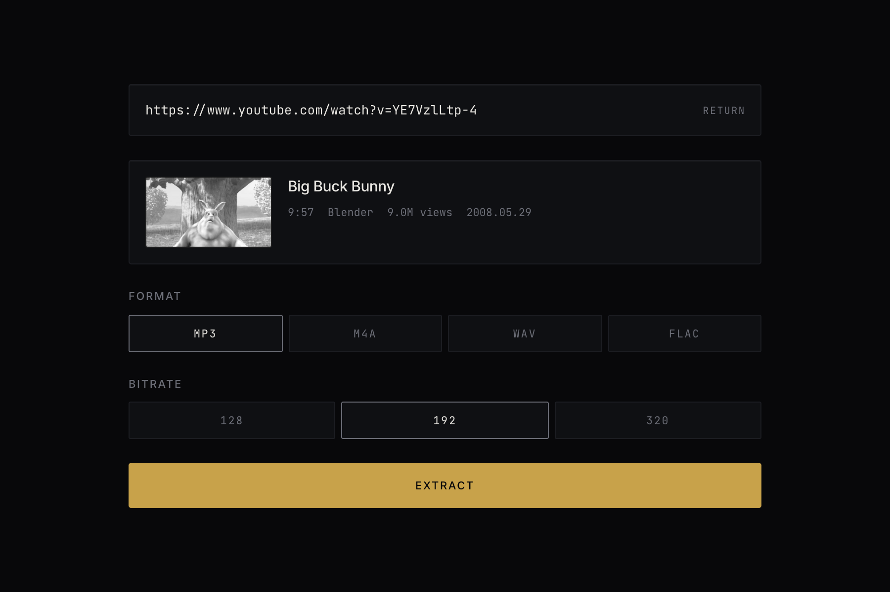

# audio-extract

Paste a YouTube link, get an audio file. Runs entirely on your own machine.

[](https://github.com/avdyanov24/audio-extract/actions/workflows/ci.yml)
[](LICENSE)
[](package.json)
[](web/package.json)
[](web/package.json)

## Why this exists

`yt-dlp -x --audio-format mp3 <url>` already does the work. What it does not give
you is a metadata preview before committing, a format picker, real progress, or a
readable reason when a video fails — you get a stack trace and a stderr dump. This
wraps the same two tools in an interface that answers those things, and throws the
file away ten minutes later so the temp directory does not fill up.

It is deliberately localhost-only. Hosted YouTube downloaders break almost
immediately because platform IPs are blocked, and keeping this on your own machine
sidesteps that entirely.

## Screenshot



The interface at rest is the URL field alone. Everything above appears once a
link resolves.

## Features

- Metadata preview (title, uploader, duration, view count, thumbnail) before extracting
- MP3 at 128/192/320, plus M4A, WAV and FLAC
- Live progress over SSE with speed and ETA, split across download and encode stages
- Failures reported by cause — private, age-restricted, region-blocked, members-only,
  removed, rate-limited, or yt-dlp being out of date — not a generic error
- Startup preflight for `yt-dlp` and `ffmpeg` that prints the install command and exits
- M4A output remuxes rather than re-encoding when the source is already AAC
- Finished files deleted after 10 minutes (configurable)

## Tech stack

| Layer | Choice |
| --- | --- |
| Frontend | React 19, Vite 6 |
| Backend | Node 20+, Express 4 |
| Extraction | yt-dlp |
| Encoding | ffmpeg |
| Transport | Server-Sent Events for progress |

## Setup

### 1. Prerequisites

Three things, all of which must be on your `PATH`:

| | Minimum | Why |
| --- | --- | --- |
| Node.js | 20 | The server uses `node:` builtins and modern ESM |
| yt-dlp | recent | Resolves the video and downloads the audio stream |
| ffmpeg | any current | Transcodes to your chosen format |

**macOS**

```bash
brew install node yt-dlp ffmpeg
```

**Linux (Debian/Ubuntu)**

```bash
sudo apt install nodejs npm ffmpeg
sudo curl -L https://github.com/yt-dlp/yt-dlp/releases/latest/download/yt-dlp -o /usr/local/bin/yt-dlp
sudo chmod a+rx /usr/local/bin/yt-dlp
```

**Windows**

```powershell
winget install OpenJS.NodeJS yt-dlp.yt-dlp Gyan.FFmpeg
```

You do not have to get this right up front. The server checks both binaries on
startup and, if either is missing, prints the install command for your platform
and exits rather than failing on every request.

### 2. Install

```bash
git clone https://github.com/avdyanov24/audio-extract.git
cd audio-extract
npm install
```

One `npm install` at the root covers both workspaces.

### 3. Run

```bash
npm run dev
```

That starts the API on `http://127.0.0.1:5178` and the UI on
`http://127.0.0.1:5173`. **Open the second one.** Vite proxies `/api` to the
backend, so the browser stays on a single origin.

You should see:

```
  audio-extract api  http://127.0.0.1:5178
  auth               open (local mode)
  limits             2 concurrent, 120 min max, 2048 MB budget
  files kept for     10 min
```

Configuration is optional — every value has a working default. Copy
`.env.example` to `.env` only when you want to change something.

### 4. Use it

Paste a YouTube URL and press Return. A metadata card appears; pick a format and
bitrate, press Extract, then download. The file is deleted from disk ten minutes
later, so save it somewhere before then.

### Running as a single process

For day-to-day use without two terminals, build the frontend once and let the
API serve it:

```bash
npm run build && npm start
```

Everything is then on `http://127.0.0.1:5178`.

## Troubleshooting

**`yt-dlp is not installed or not on PATH`** — the preflight did its job. Install
it with the command it printed, then start again.

**Every video suddenly fails, error says yt-dlp is out of date** — the usual
cause. YouTube changed something and older versions break all at once, not
gradually.

```bash
brew upgrade yt-dlp     # or: yt-dlp -U
```

The server also warns at startup once your copy is more than 60 days old.

**`YouTube asked this machine to verify it is not a bot`** — expected on
datacenter or VPN IPs, and occasionally after many requests in a short window.
Wait a few minutes, or supply cookies via `YTDLP_COOKIES`.

**`Age-restricted video`** — needs cookies from a signed-in session. Export a
Netscape-format `cookies.txt` and point `YTDLP_COOKIES` at the path. Use a
throwaway account; accounts used this way sometimes get flagged.

**`Could not reach the server`** — the UI is up but the API is not. Run
`npm run dev` rather than starting Vite alone.

**Port already in use** — set `PORT` in `.env` for the API. Vite picks the next
free port by itself and prints which one it chose.

## Configuration

All optional — see `.env.example`.

| Variable | Default | Purpose |
| --- | --- | --- |
| `PORT` | `5178` | API port |
| `HOST` | `127.0.0.1` | Bind address |
| `FILE_TTL_MINUTES` | `10` | How long a finished file survives |
| `YTDLP_COOKIES` | unset | Path to a `cookies.txt`, needed for age-restricted videos |
| `YTDLP_COOKIES_CONTENT` | unset | The file's contents instead of a path, written to a `0600` temp file at startup |
| `AUTH_TOKEN` | unset | When set, every API route requires this token |
| `MAX_CONCURRENT_JOBS` | `2` | Simultaneous extractions |
| `MAX_DURATION_MINUTES` | `120` | Sources longer than this are rejected before work starts |
| `MAX_DISK_MB` | `2048` | New jobs are refused while retained files exceed this |
| `RATE_LIMIT_MAX` | `20` | Requests per window, per client address |
| `RATE_LIMIT_WINDOW_MS` | `60000` | Rate limit window |

The limits and `AUTH_TOKEN` exist for the case where this is reachable by
someone other than you. On localhost the defaults are effectively invisible —
auth is off, and no ordinary use comes near the caps.

## Project structure

```
audio-extract/
├── server/
│   ├── index.js              Express app, routes, job pipeline
│   └── lib/
│       ├── deps.js           yt-dlp / ffmpeg preflight and staleness check
│       ├── errors.js         yt-dlp stderr to human-readable cause
│       ├── extract.js        yt-dlp and ffmpeg process orchestration
│       ├── jobs.js           Job registry, progress events, TTL cleanup
│       └── youtube.js        URL validation, filename sanitising
├── web/
│   ├── index.html
│   └── src/
│       ├── App.jsx           Phase machine: idle → ready → extracting → done
│       ├── api.js            fetch wrappers and the SSE subscription
│       ├── format.js         Duration, byte and count formatting
│       ├── styles.css        Design tokens and every component rule
│       └── components/       UrlField, MetaCard, Segmented, Progress, ErrorPanel, Result
└── .github/workflows/ci.yml
```

## Roadmap

- ESLint and Prettier, wired into CI
- Unit tests for URL parsing, error classification and filename sanitising
- Playlist support (yt-dlp already handles it; the UI does not)
- Embedded cover art for MP3 and M4A
- Cancel an extraction in flight
- Trim to a time range before encoding

## License

MIT — see [LICENSE](LICENSE).

Intended for content you own, content licensed for reuse, and personal-use copies.
What you extract is your responsibility.
